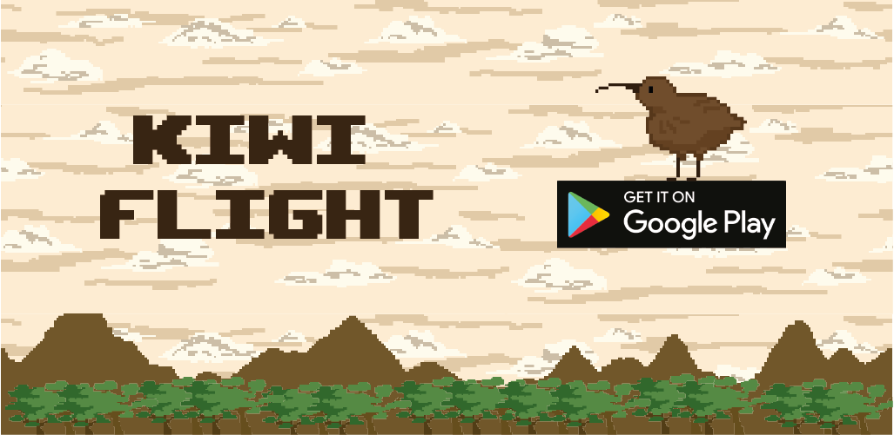
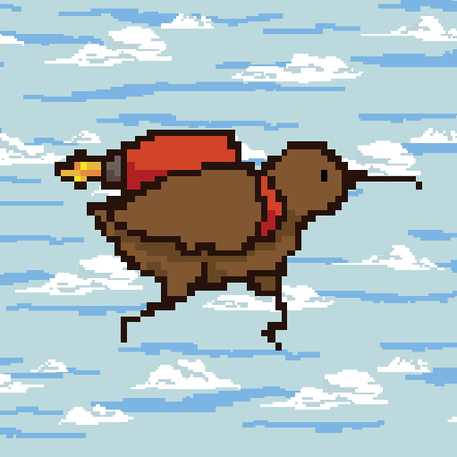
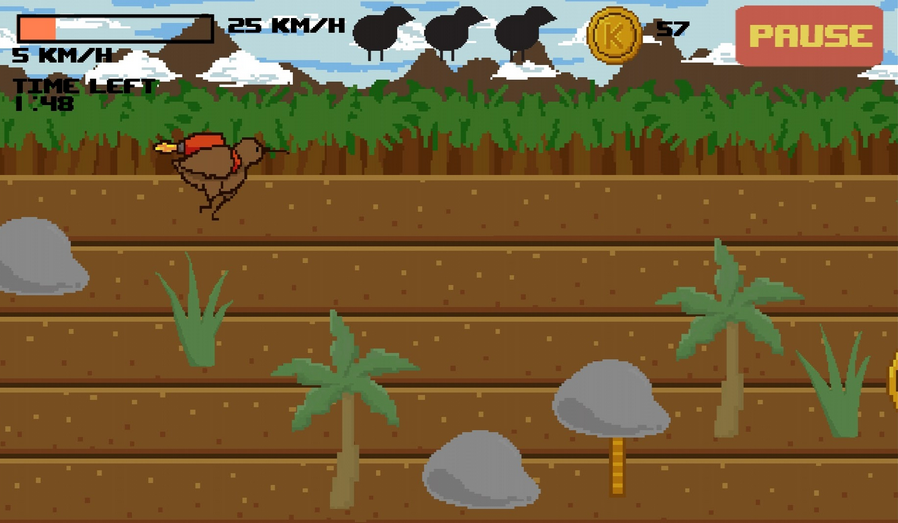
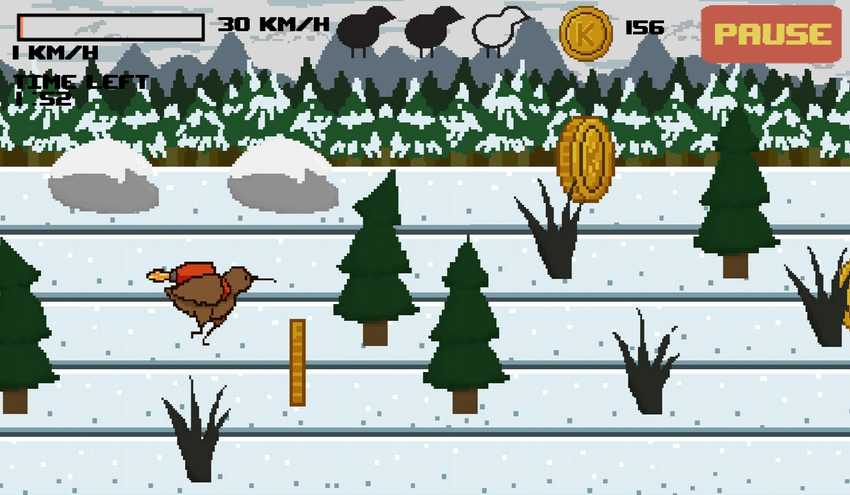
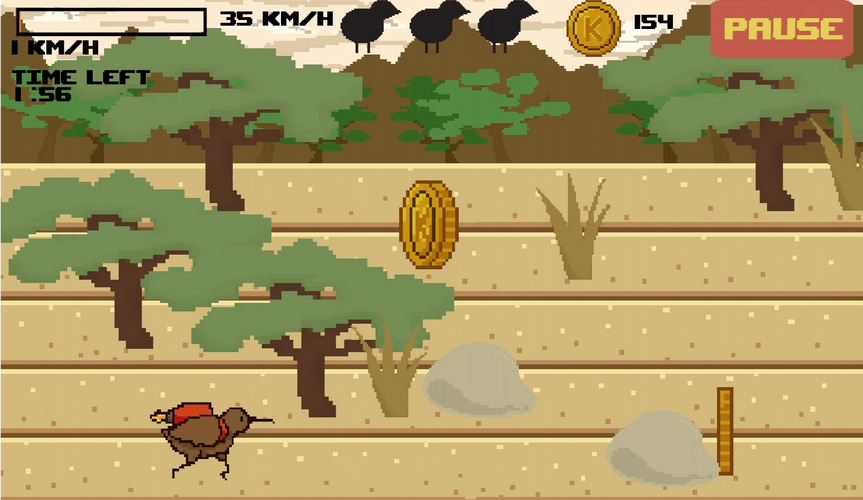
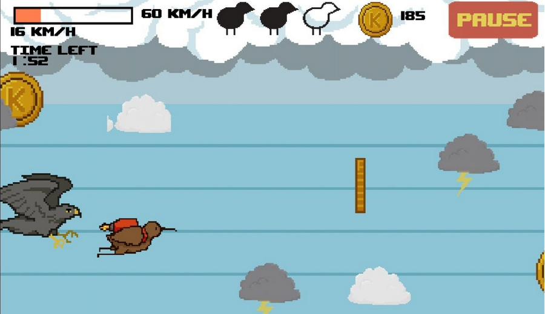
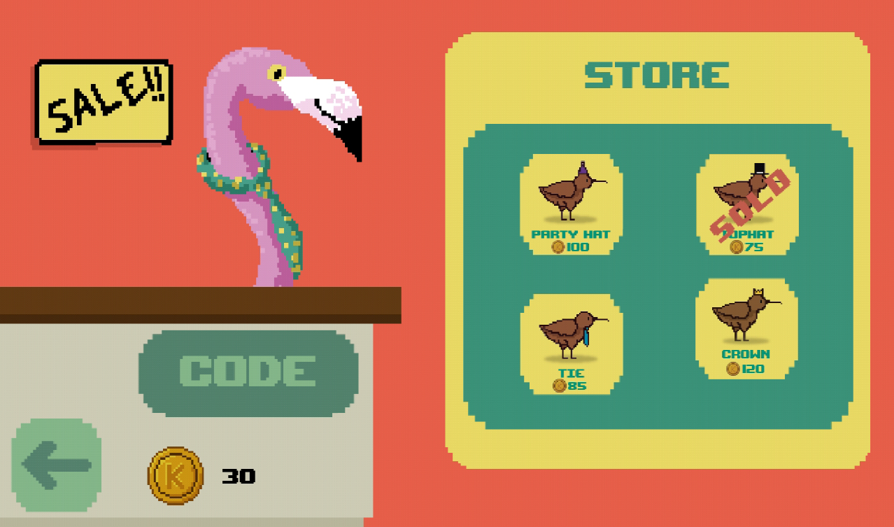
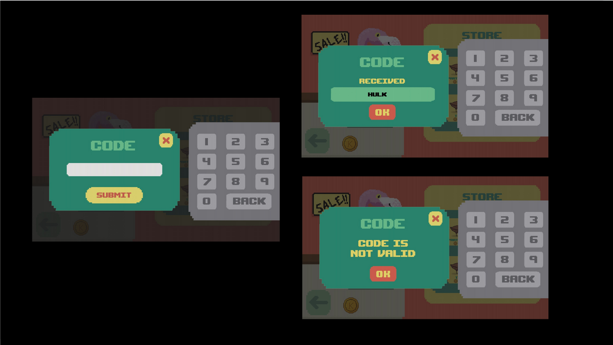
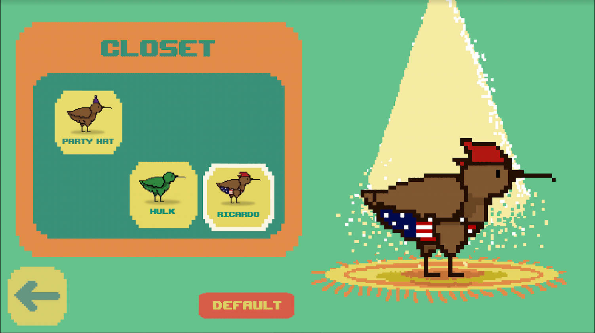

# Kiwi Flight
## Who said kiwis were flightless? Help Kiiw achieve his dream of flying!

## Table of content
* [General Info](#general-information)
* [Technologies Used](#technologies-used)
* [Features](#features)
* [Setup](#setup)
* [Acknowledgements](#acknowledgements)
* [Contact](#contact)
* [Social Media](#social-media)

## General Information

Kiwi Flight is a platform game about a kiwi who dreams of flying. Featuring traditional pixel art and animation, an original soundtrack and exciting gameplay. 
Kiiw, a flightless kiwi, dreams of flying, so he does the only reasonable thing a kiwi would do: build a jetpack. Help Kiiw avoid obstacles as he builds up speed and runs across jungles, tundras and savannas. Collect coins along the way to buy skins at the Store and try them on in the Closet. Enter secret codes and get secret Kiiw skins. This game has it all. 
Run, fly and cheer along with Kiiw as he tries to achieve his dream! Happy kiwin’!

### Developers:
- [Eduardo Gallegos](https://github.com/Eduardogallegos)
- [Mariana García](https://github.com/MGR0497)

## Technologies Used
- [Android Studio](https://developer.android.com/studio/)
- [LibGDX](https://libgdx.com/)

## Features
- 4 Levels
    - Level 1: Try

        

    - Level 2: Keep Trying

        

    - Level 3: One Last Try

        

    - Level 4: Fly

        

- Coins
    - You can collect coins along the 4 levels to buy skins on the shop.

    
- Shop & skins
    - You can buy skins for Kiiw in the shop.

    

    - You can unlock different things through the codes panel, inside the shop.
    - Codes:
        - 2222 => to unlock level 2
        - 3333 => to unlock level 3
        - 4444 => to unlock level 4
        - 1234 => Hulk skin
        - 4928 => Ricardo Milos skin
        - 0150 => 150 coins

    
- Closet
    - You can change between the skins you buy or unlock on the closet.
    
    

## Setup
1. Clone this repo.
2. Compile the project using Android Studio.
3. Generate APK.
4. Install APK on Android phone.

## Acknowledgements
Thanks to professor [Roberto Martínez Román](https://scholar.google.com/citations?user=IbP2H98AAAAJ&hl=es) for being the tutor on this project.

## Contact
Feel free to contact us!
- [Eduardo](mailto:egallegossolis@gmail.com)
- [Mariana](mailto:a01378496@itesm.mx)

## Social Media

